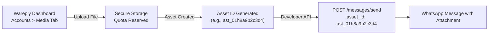

The Wareply Developer API interacts with the WhatsApp accounts and media assets configured in your Wareply workspace. This guide explains how to identify your WhatsApp accounts and how to reference rich media assets in your API requests.

## WhatsApp Account Identifiers (`account_id`)

Every message, group query, channel update, and broadcast campaign requires an `account_id` parameter. This UUID specifies which connected WhatsApp instance will transmit the message.

### Discovering Your Account ID

You can discover your WhatsApp account UUID programmatically or via the dashboard:

#### 1. Programmatic Discovery (`GET /api/v1/accounts`)

Call the [`GET /api/v1/accounts`](/api-reference/accounts/list) endpoint (requires `accounts:read` scope) to retrieve all accessible accounts, their statuses, and connected phone numbers:

```bash
curl -X GET "https://wareply.co.zw/api/v1/accounts" \
  -H "Authorization: Bearer wrp_live_<YOUR_API_KEY>" \
  -H "Accept: application/json"
```

#### 2. Manual Lookup in Dashboard

1. Log in to the [Wareply Dashboard](https://wareply.co.zw).
2. Go to **Accounts** (`/accounts`) in the main navigation.
3. Click on the WhatsApp account you wish to use.
4. The account UUID is displayed on the account overview card and in the browser URL bar:
   ```
   https://wareply.co.zw/accounts/acc_01hy8z9q2w4e1234
   ```
5. Copy the account ID (e.g., `acc_01hy8z9q2w4e1234`) to use as your `account_id`.

### Account Status & Tenancy Requirements

For an `account_id` to accept API operations:

1. **Workspace Tenancy**: The account must belong to the workspace associated with your API key. If you pass an account ID from another workspace, the API returns HTTP 404 `not_found`.
2. **API Key Restrictions**: If your API key was configured with an account whitelist (`account_restrictions`), the `account_id` must be in that list. Otherwise, the API returns HTTP 403 `account_access_denied`.
3. **Operational State**: The account must be connected and in the `ready` or `active` state. If the WhatsApp account is disconnected or initializing, the API returns HTTP 404 `account_unavailable`.

---

## Media Assets & Attachments

The Wareply Developer API does not provide a public multipart file upload endpoint (`/api/v1/media/upload`). Instead, media assets are managed through the Wareply Dashboard and referenced programmatically via their `asset_id`.

### Media Upload Workflow



### Uploading Assets in the Dashboard

1. Navigate to **Accounts** (`/accounts`) and select your WhatsApp account.
2. Select the **Media** tab (`/accounts/:id?tab=media`).
3. Click **Upload Media** and select your file.
4. Once uploaded, copy the unique **Asset ID** (`asset_id`) displayed next to the file.

---

## Supported Media Types and Size Limits

Wareply validates all media attachments against strict MIME type rules and file size limits:

| Category | Supported MIME Types | Extensions | Maximum File Size |
| :--- | :--- | :--- | :--- |
| **Images** | `image/jpeg`, `image/png`, `image/webp`, `image/gif` | `.jpg`, `.jpeg`, `.png`, `.webp`, `.gif` | 5 MB |
| **Videos** | `video/mp4`, `video/3gpp`, `video/quicktime`, `video/webm` | `.mp4`, `.3gp`, `.mov`, `.webm` | 16 MB |
| **Documents** | `application/pdf`, Microsoft Office formats (`.doc`, `.docx`, `.xls`, `.xlsx`, `.ppt`, `.pptx`), `text/plain`, `application/zip` | `.pdf`, `.doc`, `.docx`, `.xls`, `.xlsx`, `.ppt`, `.pptx`, `.txt`, `.zip` | 25 MB |

<Note>
**Audio Not Supported**: Audio files (e.g., MP3, AAC, OGG, Opus) are not supported for media asset upload or message dispatch. Attachments must be categorized as Images, Videos, or Documents.
</Note>

---

## Using `asset_id` in API Calls

When dispatching a media message, provide the `asset_id` and optional `caption`. You do not need to provide a `text` parameter when an `asset_id` is supplied.

### Example: Direct Message with Attachment

```bash
curl -X POST "https://wareply.co.zw/api/v1/messages/send" \
  -H "Authorization: Bearer wrp_live_<YOUR_API_KEY>" \
  -H "Content-Type: application/json" \
  -d '{
    "account_id": "YOUR_ACCOUNT_ID",
    "to": "+263782092900",
    "asset_id": "ast_01hy8z9q2w4e5678",
    "caption": "Please find attached your monthly statement."
  }'
```

### Security Validations on `asset_id`

To protect the server filesystem and customer data, the Developer API applies strict security checks on `asset_id`:

- **Path Injection Protection**: Any `asset_id` containing path separators (`/`, `\`) or traversal sequences (`..`) is rejected immediately with HTTP 400 `invalid_request`.
- **Ownership Verification**: The asset must belong to the specified `account_id` and workspace. Passing an asset ID that does not exist or belongs to another account returns HTTP 404 `not_found`.
- **Caption Length**: Captions are limited to a maximum of 1,024 characters for direct messages and 4,096 characters for broadcasts.
