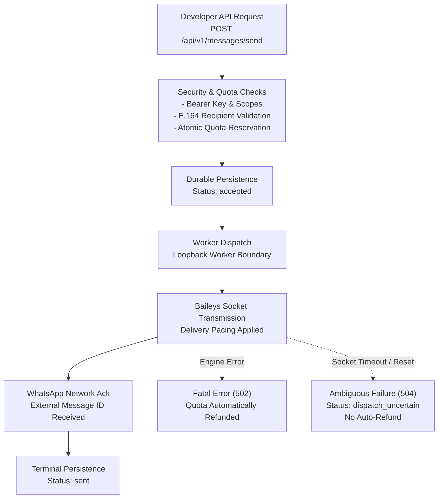

The Wareply Developer API provides a high-reliability gateway into WhatsApp business messaging. This guide details how messages flow from an API call to the WhatsApp network, how statuses are tracked, and how delivery pacing protects your connected phone numbers.

## The Message Flow

Every message submitted through the Developer API follows a deterministic multi-stage lifecycle:



---

## The "sent" Status and Handset Receipts

A key architectural aspect of the Wareply Developer API is the boundary between server transmission and handset delivery:

- **Status `sent`**: Indicates that the message passed all validations, was dispatched to the WhatsApp worker process, was transmitted over the WhatsApp WebSocket connection, and was acknowledged by WhatsApp's servers with a confirmed WhatsApp message ID (`external_message_id`).
- **No Handset Delivery or Read Receipts**: Wareply does not track or expose handset-level delivery receipts (double checkmarks) or read receipts (blue checkmarks) via Developer API endpoints or webhooks. Status `sent` is the terminal state visible in the API.

<Note>
### Transport and Delivery Semantics

Wareply sends messages through connected WhatsApp multi-device sessions rather than the Meta WhatsApp Cloud API.

When the API reports `status: sent` with an external message ID, this represents acknowledgement by the WhatsApp network. It does not confirm that the recipient's handset received or read the message. Handset delivery and read receipts are not exposed through the Developer API.
</Note>

---

## Delivery Pacing & Anti-Abuse Controls

WhatsApp enforces strict heuristics on messaging velocity to prevent spam and protect users. Rapid bursts of messages or zero-delay loops can result in temporary rate limits or permanent account bans by WhatsApp.

To protect your connected numbers, Wareply enforces:

1. **Sequential Worker Queuing**: WhatsApp messages are sent sequentially through the connection rather than in unbounded concurrent bursts.
2. **Prohibited Unsafe Flags**: The Developer API strictly blocks and rejects bypass flags such as:
   - `parallel`
   - `disable_safety`
   - `bypass_rate_limit`
   - `no_queue`
   - `force_direct`
   - `delay <= 0`

Submitting any of these parameters in request payloads triggers an immediate HTTP 400 `invalid_request` error:

```json
{
  "error": {
    "code": "invalid_request",
    "message": "Unsafe sending parameter 'parallel' is strictly prohibited. WhatsApp delivery pacing cannot be bypassed.",
    "request_id": "req_01hy8z9q2w4e",
    "details": {
      "forbidden_parameter": "parallel"
    }
  }
}
```

---

## Quota Reservation & Automatic Refunds

### Shared Monthly Message Quota

Wareply uses one shared monthly `broadcast_messages` allowance for outbound messaging across your workspace.

The allowance is consumed by individual message targets, not by API requests or campaign objects.

The following all consume the same monthly balance:

- Direct 1:1 messages
- Group messages
- Channel messages
- Broadcast campaign recipients
- Dashboard/manual broadcast recipients

For example, a Standard workspace with a 5,000-message monthly allowance that sends 200 direct messages and 300 group messages has used 500 quota units, leaving 4,500 units for the rest of the month.

API and Dashboard messaging therefore do not have separate monthly broadcast-message pools.

### Fail-Closed Reservation & Refunds

The Developer API uses fail-closed atomic quota accounting:

1. **Reservation**: Before any message is transmitted to the WhatsApp worker, 1 unit of `broadcast_messages` quota is reserved atomically.
2. **Success**: Upon successful WhatsApp transmission and acknowledgment, the quota deduction is finalized.
3. **Definitive Failure**: If the worker reports a definitive failure (e.g. invalid WhatsApp JID, recipient phone number not on WhatsApp, or worker connection failure), the API returns HTTP 502 `message_failed` and **automatically refunds** the reserved quota unit.
4. **Ambiguous Failure (`dispatch_uncertain`)**: If a socket times out or drops during transmission, the API cannot determine if WhatsApp processed the message before the disconnection. To prevent quota abuse, quota is **not** immediately refunded, and the status is recorded as `dispatch_uncertain` (HTTP 504).

---

## Messaging Modalities Comparison

Wareply supports three distinct messaging targets:

| Modality | Target Format | Canonical Scope | Typical Use Case |
| :--- | :--- | :--- | :--- |
| **Direct Message** | International E.164 Phone (`+263782092900`) | `messages:send` | One-to-one transactional alerts, notifications, customer support |
| **Group Message** | WhatsApp Group JID (`120363041234567890@g.us`) | `groups:write` | Team updates, community alerts, operational coordination |
| **Channel Update** | WhatsApp Newsletter JID (`120363049876543210@newsletter`) | `channels:write` | Public announcements, broadcast newsletters, subscriber updates |
| **Broadcast Campaign** | Array of up to 1,000 recipients | `broadcasts:write` | Scheduled marketing alerts, mass customer updates, event notifications |
