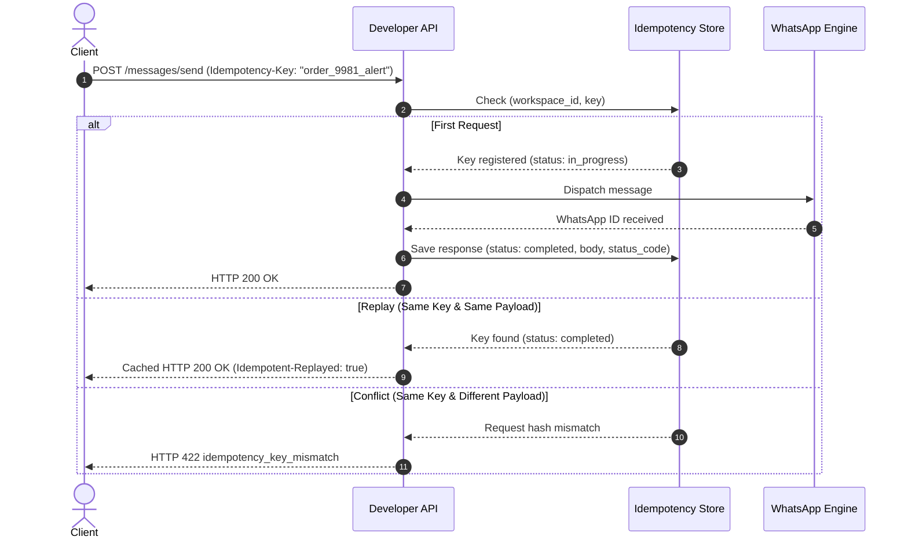

Network partitions, client timeouts, and transient connection drops can cause uncertainties about whether a mutating API request succeeded. If a client retries blindly, it risks duplicating WhatsApp messages, double-billing quota, or triggering repeated campaigns.

The Wareply Developer API provides distributed, atomic idempotency for all mutating HTTP methods (`POST`, `PUT`, `PATCH`, `DELETE`).

## How Idempotency Works

By attaching an idempotency key to your mutation request, you instruct Wareply to process the operation at most once:



---

## The Idempotency Key Header

To execute an idempotent request, include either of the following headers:

- `Idempotency-Key: <string>` (standard)
- `X-Idempotency-Key: <string>` (alternative)

### Key Format Guidelines

- **Format**: ASCII string between 1 and 255 characters.
- **Uniqueness**: Must be unique per logical operation within your workspace. We recommend using a business identifier or a version 4 UUID (e.g. `order_10023_dispatch` or `6ba7b810-9dad-11d1-80b4-00c04fd430c8`).
- **Retention**: Idempotency records are retained for **24 hours**. After 24 hours, the key expires, and a subsequent request with that key is treated as a new operation.

---

## Idempotent Replays

If the API receives a request with an `Idempotency-Key` that previously completed successfully with the exact same request body, method, and path:

1. The API **does not** re-execute the operation or send another WhatsApp message.
2. The API **does not** deduct additional message quota.
3. The original HTTP status code and JSON response body are returned immediately.
4. The response includes an `Idempotent-Replayed: true` header:

```http
HTTP/1.1 200 OK
Content-Type: application/json; charset=utf-8
Idempotent-Replayed: true
X-Idempotency-Key: order_9981_alert
X-Request-ID: req_01hy8z9q2w4e1234
```

---

## Error Handling & Conflicts

### 1. Payload Mismatch (`422 idempotency_key_mismatch`)

If you reuse an active idempotency key for a request with a different HTTP method, different URL path, or different JSON payload, the API halts execution:

```json
{
  "error": {
    "code": "idempotency_key_mismatch",
    "message": "Idempotency key was previously used with a different request payload.",
    "request_id": "req_01hy8z9q2w4e1234",
    "details": {
      "idempotency_key": "order_9981_alert"
    }
  }
}
```

**Resolution**: Generate a distinct idempotency key for each unique payload.

### 2. Concurrent Execution (`409 idempotency_conflict`)

If two identical requests bearing the same idempotency key arrive concurrently before the first request finishes processing, the second request is rejected:

```json
{
  "error": {
    "code": "idempotency_conflict",
    "message": "A request with this idempotency key is currently being processed. Please retry shortly.",
    "request_id": "req_01hy8z9q2w4e1234",
    "details": {
      "idempotency_key": "order_9981_alert"
    }
  }
}
```

**Resolution**: Implement exponential backoff before retrying so the initial operation can complete.

---

## Example: Idempotent Message Dispatch

<CodeGroup>

```bash cURL
curl -X POST "https://wareply.co.zw/api/v1/messages/send" \
  -H "Authorization: Bearer wrp_live_<YOUR_API_KEY>" \
  -H "Content-Type: application/json" \
  -H "Idempotency-Key: invoice-INV-2026-0901" \
  -d '{
    "account_id": "YOUR_ACCOUNT_ID",
    "to": "+263782092900",
    "text": "Your monthly invoice INV-2026-0901 is available."
  }'
```

```javascript Node.js
const idempotencyKey = `invoice-INV-2026-0901`;

const response = await fetch("https://wareply.co.zw/api/v1/messages/send", {
  method: "POST",
  headers: {
    "Authorization": "Bearer wrp_live_<YOUR_API_KEY>",
    "Content-Type": "application/json",
    "Idempotency-Key": idempotencyKey
  },
  body: JSON.stringify({
    account_id: "YOUR_ACCOUNT_ID",
    to: "+263782092900",
    text: "Your monthly invoice INV-2026-0901 is available."
  })
});

const isReplayed = response.headers.get("Idempotent-Replayed") === "true";
const result = await response.json();

console.log(`Replayed: ${isReplayed}`, result);
```

```python Python
import requests

idempotency_key = "invoice-INV-2026-0901"

response = requests.post(
    "https://wareply.co.zw/api/v1/messages/send",
    headers={
        "Authorization": "Bearer wrp_live_<YOUR_API_KEY>",
        "Content-Type": "application/json",
        "Idempotency-Key": idempotency_key
    },
    json={
        "account_id": "YOUR_ACCOUNT_ID",
        "to": "+263782092900",
        "text": "Your monthly invoice INV-2026-0901 is available."
    }
)

is_replayed = response.headers.get("Idempotent-Replayed") == "true"
print(f"Replayed: {is_replayed}")
print(response.json())
```

</CodeGroup>

---

## Diagnostic Endpoint: `POST /api/v1/test-idempotency`

To assist developers in verifying their client library's idempotency key generation, replay handling, and error branches without sending WhatsApp messages or deducting quota, Wareply provides a dedicated diagnostic endpoint:

`POST /api/v1/test-idempotency`

### Security & Scope

- **Authentication**: Bearer API Key required.
- **Scope**: Any valid API key.

### Usage Example

```bash
curl -X POST "https://wareply.co.zw/api/v1/test-idempotency" \
  -H "Authorization: Bearer wrp_live_<YOUR_API_KEY>" \
  -H "Content-Type: application/json" \
  -H "Idempotency-Key: test-key-1001" \
  -d '{
    "test_payload": "verify_replay",
    "counter": 1
  }'
```

### Initial Response (HTTP 200)

```json
{
  "data": {
    "message_id": "msg-1001",
    "echo": {
      "test_payload": "verify_replay",
      "counter": 1
    }
  }
}
```

<Note>
The API also returns deprecated `"messageId": "msg-1001"` alongside `"message_id"` for backwards compatibility with earlier client implementations.
</Note>

### Replay Response (HTTP 200 with `Idempotent-Replayed: true`)

Calling the exact same request again returns the cached response with the `Idempotent-Replayed: true` header.

Calling the endpoint with the same key but a modified body (`"counter": 2`) immediately triggers `422 idempotency_key_mismatch`.
